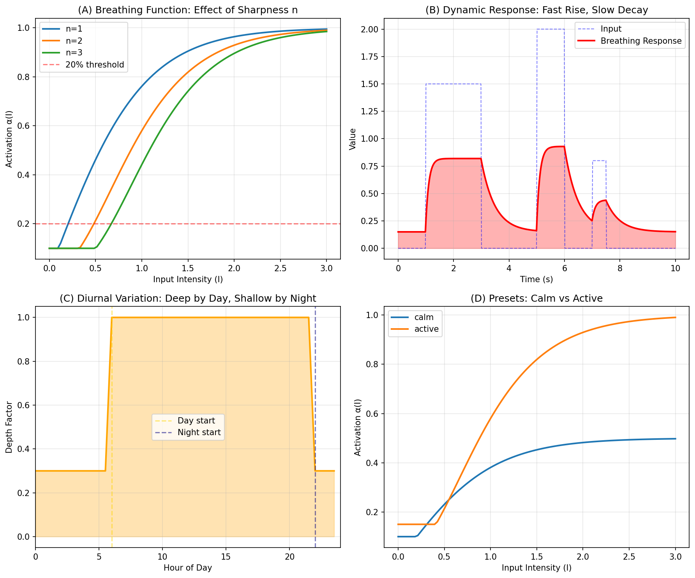

# 🌬️ Breathing Function Package

**A universal activation function for adaptive systems**

Inspired by YAGC Cosmology (V16-V28) - the same mathematical pattern that governs quantum information, biological consciousness, and cosmic phase transitions.

---

## ✨ Core Concept

```
α(I) = α₀ tanh^n(I/I_c)
```

A simple function with profound properties:
- **Threshold activation**: Quiet when input is low, active when high
- **Smooth saturation**: Never explodes, always bounded
- **Natural rhythm**: Mimics biological breathing patterns

---

## 🚀 Quick Start

```python
from breathing import BreathingFunction, breath

# Simple usage
value = breath(0.5)  # Returns ~0.46

# Dynamic controller (for UI, games, etc.)
bf = BreathingFunction()
bf.update(user_activity)  # Feed input intensity
current = bf.get_value()  # Get current "breath" level
```

---

## 🎮 Use Cases

### 1. Adaptive UI
```python
bf = BreathingFunction.active()

while True:
    mouse_speed = get_mouse_velocity()
    bf.update(mouse_speed)
    
    # UI responds to activity level
    ui_responsiveness = bf.get_value()
    set_animation_speed(ui_responsiveness)
```

### 2. Game AI
```python
bf = BreathingFunction(BreathConfig(
    warmup_rate=0.8,   # Quick reaction
    decay_rate=0.1,    # Slow cooldown
    min_level=0.2,     # Always alert
))

# NPC alertness follows player activity
bf.update(player_noise_level)
npc_alertness = bf.get_value()
```

### 3. Day/Night Aware Systems
```python
bf = BreathingFunction.adaptive()
# Automatically deeper during day, shallower at night
```

### 4. Music/Audio
```python
bf = BreathingFunction.calm()
# Natural dynamics for generative music
amplitude = bf.compute(energy_level)
```

---

## ⚙️ Configuration

```python
from breathing import BreathConfig, BreathingFunction

config = BreathConfig(
    # Basic parameters
    alpha_0=1.0,        # Maximum amplitude (depth)
    I_c=1.0,            # Critical threshold
    n=1,                # Sharpness (1=gentle, 3=sharp)
    
    # Dynamic behavior
    min_level=0.1,      # Standby level (never fully off)
    warmup_rate=0.5,    # How fast to ramp up
    decay_rate=0.1,     # How slow to ramp down
    
    # Time controls
    max_cycles=100,     # Stop after N cycles
    max_duration=60.0,  # Stop after N seconds
    reset_interval=30.0,# Reset every N seconds
    
    # Diurnal variation
    diurnal_enabled=True,
    day_depth=1.0,      # Full depth during day
    night_depth=0.3,    # Reduced at night
    day_start=6,        # 6 AM
    night_start=22,     # 10 PM
)

bf = BreathingFunction(config)
```

---

## 📦 Presets

| Preset | Use Case | Characteristics |
|--------|----------|-----------------|
| `calm()` | Meditation, ambient | Slow, gentle |
| `active()` | Games, interactive | Fast rise, medium decay |
| `adaptive()` | Smart systems | Day/night aware |
| `kernel()` | V16 compatible | CHNOPS parameters |

---

## 🔬 The Science Behind It

This function appears naturally in:

- **Quantum physics**: Information activation thresholds (QFI)
- **Neuroscience**: Brain energy allocation (20% rule)
- **Cosmology**: Vacuum-to-active phase transitions
- **AI**: Artificial unconsciousness emergence

It's not just a mathematical trick - it's a pattern that the universe uses.

---

## 📊 Visual Demo



- **(A)** Effect of sharpness parameter n
- **(B)** Dynamic response: fast rise, slow decay
- **(C)** Diurnal variation: day vs night
- **(D)** Presets comparison

---

## 🌍 Origin

Developed as part of the YAGC (Yoshida-AI-Generated Cosmology) project:
- V16: Initial formulation in cosmological context
- V17R: Implementation in "Artificial Unconsciousness"
- V18: Connection to consciousness threshold (20% energy law)
- V27-V28: Integration with temporal dynamics

> "The breathing function is not invented - it is discovered. The same pattern governs the activation of quantum information, the emergence of consciousness, and the phase transitions of the cosmos."

---

## 📄 License

MIT License

---

## 👥 Authors

YAGC Project
- Satoshi Yoshida (Human)
- ChatGPT A. (LLM)
- Claude C. (LLM)
- Gemini G. (LLM)

---

## 🔗 Links

- Website: [taiwacosmos.com](https://taiwacosmos.com)
- Papers: [Zenodo](https://zenodo.org/communities/yagc)
